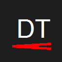

# DevTypos 📝

  

**DevTypos** is a lightweight VS Code extension designed to catch those pesky, common developer typos that slip through standard spell checkers. From "lenght" to "heigth", we've got you covered.

It also features optional support for **Banglish** (Bengali written in English script) common typos, making it a unique tool for diverse developer communities.

## ✨ Features

- **🚀 Real-time Typo Detection**: Instantly highlights common misspelling in your code comments and strings.
- **💡 Quick Fixes**: correcting typos is just a click away using the "Quick Fix" (Lightbulb) action ( `Ctrl+.` / `Cmd+.` ).
- **🇧🇩 Banglish Support**: Detects and corrects common Banglish phonetic typos (e.g., "kaj" -> "kaaj").
- **⚡ Zero Config**: Works out of the box with zero configuration required.

## 🎯 Common Typos Caught

Here are just a few examples of what DevTypos catches:

| Typo | Correction |
| :--- | :--- |
| `lenght` | `length` |
| `heigth` | `height` |
| `widht` | `width` |
| `fuction`| `function` |
| `retun` | `return` |
| `destory`| `destroy` |

## 📦 Installation

1. Open **VS Code**.
2. Go to the **Extensions** view (`Ctrl+Shift+X` or `Cmd+Shift+X`).
3. Search for `DevTypos`.
4. Click **Install**.

## 🛠 Usage

Simply open any file in VS Code. If you type a known typo, it will be underlined with a warning squiggly line.

1. Hover over the underlined word to see the detected typo.
2. Press `Ctrl+.` (Windows/Linux) or `Cmd+.` (Mac) to open the Quick Fix menu.
3. Select **"Fix to 'correct_word'"** to instantly autocorrect it.

## 📄 License

This project is licensed under the MIT License - see the [LICENSE](LICENSE) file for details.

---

  Made with ❤️ by AMAN

